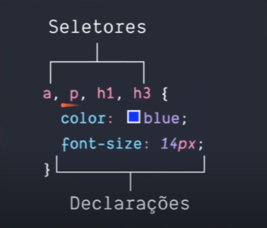
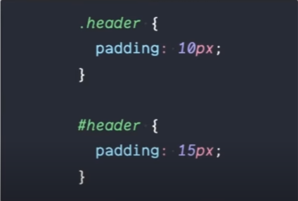
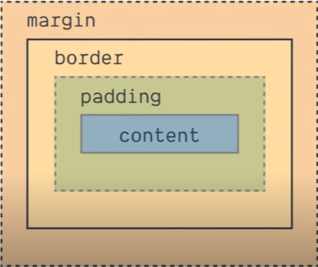

# **Anotações CSS3**

## **Como implementar no codigo**

Primeiramente e necessario incorporar no codigo html, utilizando a seção **HEAD**  o codigo:
~~~~
<link rel="stylesheet" href="style.css">
~~~~

E tambem  na pasta do projeto o **adicionar o novo arquivo _style.css_**.

## **Exemplo**

~~~~
<!DOCTYPE html>
<html> 
    <head>
        <meta charset="utf-8">
        <title></title> 
        <link rel="stylesheet" href="style.css"> 
        <>
    </head>
    <body>
    </body>
</html>
~~~~

 

## **Maneira como CSS3 funciona**

 

### **Seletores**

Desta maneira iremos fazer referência direta a partes do html, porém acaba sendo pouco organizado além de ser um seletor de tipo.

### **ID x Classe**

**IDs e Classes** são maneiras mais organizadas e precisas para modificar e estiliza, podendo representar qualquer tipo de elemento.

**IDs** são usados somente uma vez na pagina. A maneira de usar no css e precedendo um **"#" antes do seu nome**.

**Classes** podem ser usadas varias vezes na mesma pagina. A maneira de usar no css e precedendo um **"." antes do seu nome**.

 

### **Exemplo**

 

**HTML**
~~~~
<!DOCTYPE html>
<html> 
    <head>
        <meta charset="utf-8">
        <title></title> 
        <link rel="stylesheet" href="style.css"> 
        <>
    </head>
    <body>
        <header>
            
            <h1 id="title">Blog</h1>                                           ---> ID "title"       
        <header/>
                <section>
            <header>
                <h2 class="subtitle">Posts</h2>                                ---> Class "subtitle"      
            </header>
            <article class="post">
                <header>
                    <h3 class="post_title">Post #1</h3>                        ---> Class "post_title"
                    
                </header>
                

                    Lorem ipsum dolor sit amet <a href="https://www.google.com" target="_blank"> consectetur adipisicing </a> elit. <a href="mailto:dhenriquea@gmail.com"> ducimus quia magni quae</a> labore sit nihil optio distinctio quos perferendis, consequuntur qui explicabo eaque! Sint, alias!
                

            </article>
        </section>
    </body>
</html>
~~~~

**CSS**

~~~~
#title {

}

.subtitle {

}

.post_title {

}
~~~~

 

## **Box-Model**

 

### **Representação**

 

**Box Model** e a representação do **layout** do site, em uma pagina cada elemento e representado como um box retangular. Com seu conjuto de propriedades como **margin**, **border**, **padding** e **content**.

 

- **Margin** basicamente e o espaçamento entre elementos;

- **Border** são as bordas;

- **Padding** se resume como espaçamento entre as bordas e o content(conteúdo), sua diferença para o
_**Margin**_ e a possibilidade de modificação do fundo;

- **Content** seria o conteúdo em forma de texto, imagem ou video;

 

## **Estilizando elementos**

 

### **Padding**

~~~~
.exemplo {
    padding: 10px;             ----> forma basica
ou
    padding: 10px 5px          ----> X e Y 
ou
    padding: 10px 10px 5px 0;  ----> superior 
    direita inferior esquerdo
ou
    padding-top: 10px;         ----> forma especifica 
    padding-right: 10px;
    padding-bottom: 10px;
    padding-left: 10px;
}
~~~~

 

### **Margin**

~~~~
.exemplo {
    margin: 10px;                           ----> forma basica
ou
    margin: 10px 5px                        ----> X e Y 
ou
    margin: 10px 10px 5px 0;                ----> ↑ → ↓ ← 
ou
    margin-top: 10px;                       ----> forma especifica 
    margin-right: 10px;
    margin-bottom: 5px;
    margin: 0;
}
~~~~

 

### **Background**

~~~~
.exemplo {
    background-color: "color";
    background-imag: url("");
    background-position: top;
}
~~~~

 

### **Border**

~~~~
.exemplo {
    border: 3px solid "color";              ----> Controle geral: largura / estilo / cor
ou
    border-top: 2px dotted "color";         ----> Controle de cada lado
    border-right: 4px dashed "color";
    border-bottom: 4px solid "color";
    border-left: 4px dotted "color";
ou
    border-top-width: 3px;                  ----> Controle especifico de cada lado
    border-top-color: "color"
    border-top-style:
}
~~~~

 

### **Border-radius**

~~~~
.exemplo {
    border-radius: 10px;                    ----> Controle geral

    border-radius: 50%;                     ----> Controle geral em %

    border-radius: 10% 20%;                 ----> Controle geral em %: X e Y

    border-radius: 10% 20% 15% 22%          ----> Controle geral em %: ↑ → ↓ ←
}
~~~~

 

## **Estilizando Texto**

 

### **font-family**

~~~~
.exemplo {
    font-family: Verdana;                   ----> fonte(neste caso ultilizando uma "web safe font" que sempre vai funcionar)

    font-family: Verdana, Arial;            ----> fonte + fonte backup, assim mitigando o caso da primeira bugar
}
~~~~

 

### **font-size**

~~~~
.exemplo {
    font-size: 10px;                        ----> Controla o tamanho da fonte, variando somente nas unidades
}
~~~~

 

### **font-style**

~~~~
.exemplo {
    font-style: normal;                     ----> Deixa a fonte no seu modo nativo
ou
    font-style: italic;                     ----> Deixa a fonte em estilo italico, necessario ver a compatibilidade 
}
~~~~

 

### **font-weight**

~~~~
.exemplo {
    font-weight: normal;                     ----> Altera o peso do texto para o nativo
ou
    font-weight: bold;                       ----> Altera o peso do texto para Bold(negrito)  
}
~~~~

 

### **font-transform**

~~~~
.exemplo {
    font-transform: uppercase;                ----> Maiúsculo
ou
    font-transform: lowercase;                ----> Minúsculo  
ou
    font-transform: lowercase;                ----> Todas primeiras letras em maiúsculo  
}
~~~~

 

### **font-decoration**

~~~~
.exemplo {
    font-decoration: underline;                ----> Linha a baixo
ou
    font-decoration: overline;                 ----> Linha a cima
ou
    font-decoration: line-through;             ----> Linha ao centro
}
~~~~

 

## **Estilizando Listas**

 

### **list-style-type**

~~~~
.ul {
    list-style-type: square;                    ----> Alterar símbolo para um quadrado
}
.ol {
    list-style-type: upper-roman;               ----> Alterar símbolo para algarismo romano maiusculo
}
.ul {
    list-style-type: "\1F44D";                  ----> Alterar símbolo para um simbolo/emoji 
}
.ul {
    list-style-type: none;                      ----> Retira o símbolo da lista 
}
~~~~

 

### **list-style-image**

~~~~
.ul {
    list-style-image: url("rocket.png");        ----> Alterar símbolo para um quadrado
}
~~~~

 

## **Dimensão e alinhamento**

Uma parte extremamente importante no desenvolvimento de layouts.

 

- **Width e Height** Largura e altura;

- **Max-Width e Max-Height** largura maxima e altura maxima, possui um auto ajuste;

- **Margin** tem o valor **auto**, serve para alinhar o elemento automaticamente;

- **Text align** usado para alinhar textos;

  **Exemplos**
  ~~~~
  .exemplo {
        text-align: center;
    ou
        text-align: left;
    ou
        text-align: right;
    ou
        text-align: justify;
  }
  ~~~~

 

# Mais conteudos

- **[W3Schools - CSS3](https://www.w3schools.com/css/default.asp)**
- **[Anotações HTML5]("./HTML5.md")**
