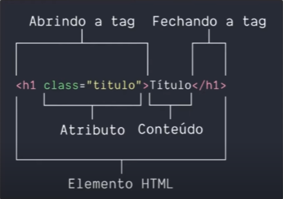

# **Anotações HTML5**

## **Maneira como HTML funciona**

 

## **Estrutura base do HTML**

~~~
<!DOCTYPE html>
<html> 
    <head>
        <meta charset="utf-8">
        <title></title>  
    </head>
    <body>
    </body>
</html>
~~~

 

## **Semanticas**

 

~~~~
<section> 
~~~~ 

Representa uma seção genérica de conteúdo quando não houver um elemento mais específico para isso.

~~~~
<header> 
~~~~

 É o cabeçalho da página ou de uma seção da página e normalmente contém logotipos, menus, campos de busca.

~~~~
<article> 
~~~~

 Representa um conteúdo independente e de maior relevância dentro de uma página, como um post de blog, uma notícia em uma barra lateral ou um bloco de comentários. Um article pode conter outros elementos, como header, cabeçalhos, parágrafos e imagens.

~~~~
<aside>
~~~~

É uma seção que engloba conteúdos relacionados ao conteúdo principal, como artigos relacionados, biografia do autor e publicidade. Normalmente são representadas como barras laterais.

~~~~
<footer>
~~~~

Esse elemento representa o rodapé do conteúdo ou de parte dele, pois ele é aceito dentro de vários elementos, como article e section e até do body. Exemplos de um conteúdo são informações de autor e links relacionados.

 

## **Textos**

 

~~~~
<h1>-<h6>
~~~~

São utilizados para marcar a importância dos títulos, sendo **"h1"** o mais importante e **h6** o menos. Uma dica: use apenas um **h1** por página, pois ele representa o objetivo da sua página.

~~~~

~~~~

Representa um parágrafo, mas ele não suporta apenas texto, podemos adicionar imagens, código, vídeos e vários outros tipos de conteúdo dentro dele.

 

### **Exemplo - Textos**

 

#### **h1 ate h6**
~~~~
<h1>HI</h1>
<h2>HI</h2>
<h3>HI</h3>
<h4>HI</h4>
<h5>HI</h5>
<h6>HI</h6>
~~~~

**Resultado**

<h1>HI</h1>
<h2>HI</h2>
<h3>HI</h3>
<h4>HI</h4>
<h5>HI</h5>
<h6>HI</h6>

 

## **Links**

 

~~~~
<a>
~~~~

Significa anchor/âncora, ele representa um hyperlink, é ele que interliga vários conteúdos e páginas na web.

 

### **Atributos - Links**

 

~~~~
href =""
~~~~

hyperlink para onde sua âncora aponta, pode ser uma **página** do seu ou de outro site, um **e-mail** e até mesmo um **telefone**, os dois últimos precisam dos prefixos _**mailto:**_ e _**tel:**_, respectivamente.

~~~~
target="_blank"
~~~~

Ira abrir os links em outra aba do navegador usando o **valor _blank**.

 

### **Exemplo - Links**

 

#### **Link, email e telefone**
~~~~
Abrir um link
<a href="https://www.google.com" target="_blank"> Google </a>

Abrir um email
<a href="mailto:dhenriquearantes@gmail.com"> Email </a>

Abrir um telefone
<a href="tel:40028922"> Bom dia e Cia</a>
~~~~

**Resultado**

Abrir um link
<a href="https://www.google.com" target="_blank"> Google </a>

Abrir um email
<a href="mailto:dhenriquearantes@gmail.com"> Email </a>

Abrir um telefone
<a href="tel:40028922"> 40028922 </a>

 

## **Imagens**

 

~~~~

~~~~

A tag que se utiliza para colocar imagens, além de não conter fechamento ela possui somente 2 atributos.

 

### **Atributos - Imagens**

 

~~~~
scr =""
~~~~

Source e onde colocamos o caminho da imagem, sendo ela **local** ou atras de um **link**.

~~~~
alt =""
~~~~

Apesar de não ser obrigatoria, ela nos da o poder de descrição da imagem. Assim quando o link ou arquivo e perdido e mostrando pelo menos o nome.

 

### **Exemplo - Imagens**

 

#### **Link, email e telefone**
~~~~

~~~~

**Resultado**

 

## **Listas**

 

~~~~
<ul>
~~~~

Cria uma **lista não ordenada**, onde a ordem dos elementos não é importante, e é representada com pontos, círculos ou quadrados.

~~~~
<ol>
~~~~

Criar lista ordenadas, nessas a ordem importa, portanto elas são representadas com números, algarismos romanos ou letras.

 

### **Atributos - Listas**

 

~~~~
<li>
~~~~

É um item dentro de uma dessas listas. Um **li** pode conter vários tipos de conteúdos, como parágrafos, imagens e até outras listas.

 

### **Exemplo - Listas**

 

#### **Não ordenada ou "ul"**
~~~~
<Ul>
    <li>
        <a href="mailto:dhenriquearantes@gmail.com" target="_blank"> Email </a>
    </li>
    <li>
        <a href="https://www.linkedin.com/in/dhenriquearantes/" target="_blank"> Linkedin </a>
    </li>
    <li>
        <a href="https://github.com/dhenriquearantes" target="_blank"> Portfólio </a>
    </li>
</ul> 
~~~~

**Resultado**

<Ul>
    <li>
        <a href="mailto:dhenriquearantes@gmail.com" target="_blank"> Email </a>
    </li>
    <li>
        <a href="https://www.linkedin.com/in/dhenriquearantes/" target="_blank"> Linkedin </a>
    </li>
    <li>
        <a href="https://github.com/dhenriquearantes" target="_blank"> Portfólio </a>
    </li>
</ul> 

 

#### **Ordenada ou "ol"**
~~~~
<ol>
    <li>
        <a href="mailto:dhenriquearantes@gmail.com" target="_blank"> Email </a>
    </li>
    <li>
        <a href="https://www.linkedin.com/in/dhenriquearantes/" target="_blank"> Linkedin </a>
    </li>
    <li>
        <a href="https://github.com/dhenriquearantes" target="_blank"> Portfólio </a>
    </li>
</ol> 
~~~~

**Resultado**

<ol>
    <li>
        <a href="mailto:dhenriquearantes@gmail.com" target="_blank"> Email </a>
    </li>
    <li>
        <a href="https://www.linkedin.com/in/dhenriquearantes/" target="_blank"> Linkedin </a>
    </li>
    <li>
        <a href="https://github.com/dhenriquearantes" target="_blank"> Portfólio </a>
    </li>
</ol> 

 

# Mais conteudos

- **[W3Schools - HTML5](https://www.w3schools.com/html/default.asp)**
- **[Anotações CSS3]("./CCS3.md")**