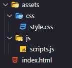

# **Anotações intrudução JAVACRIPT**

## **Motivos para utilizar o JAVASCRIPT**

 

- Leve

- Interpretada

- Baseada em Protótipos

- Multiparadigma

- Comumente utilizada em aplicações
web client-side

- Segue o padrão ECMAScript

 

## **Aplicações da linguagem**
 

- Web

- Mobile

- Smartwatches

- Games

- Internet of Things

- APIs

 

## **Recursos básicos da linguagem**

 

### **Comentário em linha ou bloco**

 

Para fazer um **comentário de linha** devemos colocar // antes do texto 

Exemplo

~~~~
// var y = 9
~~~~

O **comentário de blocos** devemos colocar antes do código **"/*"** e depois **"*/"**

~~~~
/* 
var y = 10
*/
~~~~

 

## **Variável**

Pode ser alterado o valor a qualquer momento, podendo ser manipulado durante a execução.

**Exemplo**

~~~~
var y = 9
~~~~

## **Constante**

Permanece com o mesmo valor sempre, não podendo ser alterado durante a execução

**Exemplo**

~~~~
cons y = 9
~~~~

 

## **Funções**

São um conjunto de instruções que executa uma tarefa ou calcula um valor.

**Exemplo**

~~~~
function soma (a, b){
    return a + b;
}

soma(3, 5);
~~~~

 

### **Estrutura de projeto**

 

Estrutura para pequenos projetos, consiste na organização como e mostrando no exemplo a seguir.

 

## **Como implementar no codigo HTML**

Primeiramente e necessario incorporar no codigo html, utilizando a seção **HEAD**  o codigo:
~~~~

~~~~

E tambem  na pasta do projeto o **adicionar o novo arquivo _style.css_**.

## **Exemplo**

~~~~
<!DOCTYPE html>
<html> 
    <head>
        <meta charset="utf-8">
        <title></title> 
        <link rel="stylesheet" href="assests/css/style.css"/> 
        
    </head>
    <body>
    </body>
</html>
~~~~

 
