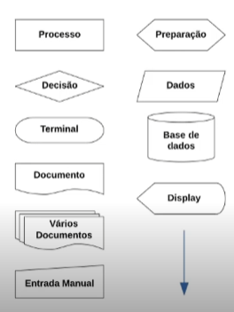
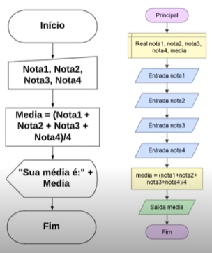

# **Lógica de progamação = teoria da progamação**

## Programa de computador e uma sequencia de passos(receita), que ao ser executado ira solucionar um problema ou executar uma tarefa.

 

_Obs: Lógica e basicamente o que precisa ser feito(planejamento)._

 

## **Tipos de algoritmos:**

 

- **Narrativa - "Receita de bolo"**

  ~~~~
  Media aluno:

    1 - Identificar a primeira nota do aluno;
    2 - Identifcar a segunda nota do aluno;
    3 - Somar as duas notas;
    4 - Dividir o resultado por 2;
    5 - Verificar se o resultado e maior ou igual a 6 foi aprovado;
    6 - Senão foi reprovado;
  ~~~~

 

- **Fluxograma ou Diagrama de blocos**

          

 

- **Pseudocódigo ou linguagem estruturada**

  ~~~~
  Media aluno:

    programa{
    
        funcao inicio(){

            real nota1,nota2,nota3,nota4,media
            cadeia aluno
            
            escreva("Digite o nome do aluno:")
            leia(aluno)
            escreva("Digite a nota 1:")
            leia(nota1)
            escreva("Digite a nota 2:")
            leia(nota2)
            escreva("Digite a nota 3:")
            leia(nota3)
            escreva("Digite a nota 4:")
            leia(nota4)

            media = (nota1+nota2+nota3+nota4)/4
            escreva("O aluno: " + aluno + "obteve a média: " + media)
        }
    }
  ~~~~

   

  ## **Legibilidade de código:**

   

  Um algoritmo deve ser compreendido por qualquer pessoa mesmo que ela não tenha participado da criação do mesmo. Para isso ser possível devesse escrever o código seguindo alguns princípios básicos de modo a torna-lo de **fácil entendimento**.